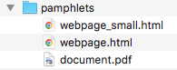

===============
organize-ebooks
===============
Automatically organize folders with potentially huge amounts of unorganized ebooks. This is a Python port of `organize-ebooks.sh <https://github.com/na--/ebook-tools/blob/master/organize-ebooks.sh>`_ 
from `ebook-tools <https://github.com/na--/ebook-tools>`_ written in shell by `na-- <https://github.com/na-->`_.

.. contents:: **Contents**
   :depth: 3
   :local:
   :backlinks: top

About
=====
`organize_ebooks.py <./organize_ebooks/scripts/organize_ebooks.py>`_ automatically organize folders with potentially huge amounts of unorganized 
ebooks. This is done by renaming the files with proper names and moving them to other folders.

It is a Python port of `organize-ebooks.sh <https://github.com/na--/ebook-tools/blob/master/organize-ebooks.sh>`_ 
from `ebook-tools <https://github.com/na--/ebook-tools>`_ written in shell by `na-- <https://github.com/na-->`_.

`:star:` Other related Python projects based on ``ebook-tools``:

- `convert-to-txt <https://github.com/raul23/convert-to-txt>`_: convert documents (pdf, djvu, epub, word) to txt
- `find-isbns <https://github.com/raul23/find-isbns>`_: find ISBNs from ebooks (pdf, djvu, epub) or any string given as input to the script
- `ocr <https://github.com/raul23/ocr>`_: run OCR on documents (pdf, djvu, and images)
- `split-ebooks-into-folders <https://github.com/raul23/split-ebooks-into-folders>`_: split the supplied ebook files into 
  folders with consecutive names
  
Dependencies
============
.. TODO: remove '-todo' from link
`:warning:` 

   You can ignore this section and go straight to pulling the `Docker image <#installing-with-docker-recommended-todo>`_ which contains all the 
   required dependencies and the Python package ``organize_ebooks`` already installed. This section is more for showing how I setup my system
   when porting the shell script `organize-ebooks.sh <https://github.com/na--/ebook-tools/blob/master/organize-ebooks.sh>`_ et al. to Python.

This is the environment on which the package `organize_ebooks <./organize_ebooks/y>`_ was developed and tested:

* **Platform:** macOS
* **Python**: version **3.7**
* `p7zip <https://sourceforge.net/projects/p7zip/>`_ for ISBN searching in ebooks that are in archives.
* `Tesseract <https://github.com/tesseract-ocr/tesseract>`_ for running OCR on books - version 4 gives 
  better results. 
  
  `:warning:` OCR is a slow resource-intensive process. Hence, by default only the first 7 and last 3 pages are OCRed through the option
  ``--ocr-only-first-last-pages``. More info at `Script options <#script-options>`_.
* `Ghostscript <https://www.ghostscript.com/>`_: ``gs`` converts *pdf* to *png* (useful for OCR)
* `textutil <https://ss64.com/osx/textutil.html>`_ or `catdoc <http://www.wagner.pp.ru/~vitus/software/catdoc/>`_: for converting *doc* to *txt*

  **NOTE:** On macOS, you don't need ``catdoc`` since it has the built-in ``textutil``
  command-line tool that converts any *txt*, *html*, *rtf*, 
  *rtfd*, *doc*, *docx*, *wordml*, *odt*, or *webarchive* file
* `DjVuLibre <http://djvu.sourceforge.net/>`_: 

  - it includes ``ddjvu`` for converting *djvu* to *tif* image (useful for OCR), and ``djvused`` to get number of pages from a *djvu* document
  - it includes ``djvutxt`` for converting *djvu* to *txt*
  
    `:warning:` 
  
    - To access the *djvu* command line utilities and their documentation, you must set the shell variable ``PATH`` and ``MANPATH`` appropriately. 
      This can be achieved by invoking a convenient shell script hidden inside the application bundle::
  
       $ eval `/Applications/DjView.app/Contents/setpath.sh`
   
      **Ref.:** ReadMe from DjVuLibre
    - You need to softlink ``djvutxt`` in ``/user/local/bin`` (or add it in ``$PATH``)
* `poppler <https://poppler.freedesktop.org/>`_: 

  - it includes ``pdftotext`` for converting *pdf* to *txt*
  - it includes ``pdfinfo`` to get number of pages from a *pdf* document if `mdls (macOS) <https://ss64.com/osx/mdls.html>`_ is not found.

`:information_source:` *epub* is converted to *txt* by using ``unzip -c {input_file}``

|

**Optionally:**

- `calibre <https://calibre-ebook.com/>`_: 

  - Versions **2.84** and above are preferred because of their ability to manually specify from which
    specific online source we want to fetch metadata. For earlier versions you have to set 
    ``ISBN_METADATA_FETCH_ORDER`` and ``ORGANIZE_WITHOUT_ISBN_SOURCES`` to empty strings.

  - for fetching metadata from online sources
  
  - for getting an ebook's metadata with ``ebook-meta`` in order to search it for ISBNs

  - for converting {*pdf*, *djvu*, *epub*, *msword*} to *txt* (for ISBN searching) by using calibre's 
    `ebook-convert <https://manual.calibre-ebook.com/generated/en/ebook-convert.html>`_
  
    `:warning:` ``ebook-convert`` is slower than the other conversion tools (``textutil``, ``catdoc``, ``pdftotext``, ``djvutxt``)

- **Optionally** `poppler <https://poppler.freedesktop.org/>`_, `catdoc <http://www.wagner.pp.ru/~vitus/software/catdoc/>`_ 
  and `DjVuLibre <http://djvu.sourceforge.net/>`_ can be installed for **faster** than calibre's conversion of ``.pdf``, ``.doc`` and ``.djvu`` files
  respectively to ``.txt``.

- **Optionally** the `Goodreads <https://www.mobileread.com/forums/showthread.php?t=130638>`_ and 
  `WorldCat xISBN <https://github.com/na--/calibre-worldcat-xisbn-metadata-plugin>`_ calibre plugins can be installed for better metadata fetching.

|

`:star:`

  If you only install **calibre** among these dependencies, you can still have
  a functioning program that will organize ebook collections: 
  
  * fetching metadata from online sources will work: by `default 
    <https://manual.calibre-ebook.com/generated/en/fetch-ebook-metadata.html#
    cmdoption-fetch-ebook-metadata-allowed-plugin>`__
    **calibre** comes with Amazon and Google sources among others
  * conversion to *txt* will work: `calibre`'s own ``ebook-convert`` tool
    will be used
    
  However, accuracy and performance will be affected as explained in the list of dependencies above.

Installing with Docker (Recommended)
====================================
`:information_source:` It is recommended to install the package `organize_ebooks <./organize_ebooks/>`_ with **Docker** because the Docker
container has all the many `dependencies <#dependencies>`_ already installed along with the ``organize_ebooks`` package. I also included the
original bash shell scripts from `ebook-tools <https://github.com/na--/ebook-tools>`_.

1. Pull the Docker image from hub.docker.com::

    $ docker pull raul23/organize:latest

2. Run the Docker container::

   $ docker run -it -v /some/host/folder/:/unorganized-books raul23/organize:latest

3. TODO

Content of the Docker image
===========================
`:information_source:` 
 
 - The layers of the Docker image can be checked in details at the project's `Docker repo 
   <https://hub.docker.com/layers/raul23/organize/latest/images/sha256-a4b61239c62c6834cc356dfd3736de8e9fa1b33d26a82f02bd05476328918012?context=repo>`_ where you can find the commands used in the Dockerfile for installing all the dependencies in the base OS (Ubuntu 18.04).
 - This Python-based Docker image is formed from the one used by the project `ebook-tools <https://github.com/na--/ebook-tools>`_ (shell scripts) 
   which you can find at the `Docker Hub <https://hub.docker.com/r/ebooktools/scripts/tags>`_. One of the main differences being that 
   the base OS is Ubuntu 18.04 and Debian, respectively.

The `Docker image <https://hub.docker.com/repository/docker/raul23/organize/general>`_ for this project contains the following components:

1. Ubuntun 18.04: the base system of the Docker container
2. All the `dependencies <#dependencies>`_ (required and optional) needed for supporting all the features (e.g. OCR, document 
   conversion to text) offered by the package ``organize_ebooks``:

   - Python 3.6 along with ``setuptools`` and ``wheel``
   - p7zip
   - Tesseract
   - Ghostscript: ``gs``)
   - catdoc
   - DjVuLibre: ``ddjvu``, ``djvused``, ``djvutxt``
   - Poppler: ``pdftotext`` and ``pdfinfo``
   - calibre: ``ebook-convert``, ``ebook-meta``, calibre's metadata plugins (Goodreads and WorldCat xISBN)
   - unzip
3. TODO
4. The shell scripts from the project `ebook-tools <https://github.com/na--/ebook-tools>`_::

    convert-to-txt.sh, find-isbns.sh, interactive-organizer.sh, lib.sh, organize-ebooks.sh, rename-calibre-library.sh, split-into-folders.sh
5. ``user``: a user named ``user`` is created with UID 1000. Thus you don't have root privileges within the Docker container.

Installing the development version with ``pip``
===============================================
Install
-------
`:information_source:` After you have installed the `dependencies <#dependencies>`_, you can then install the 
package `organize_ebooks <./organize_ebooks/>`_.

To install the development (bleeding-edge) version of the package `organize_ebooks <./organize_ebooks/>`_::

 $ pip install git+https://github.com/raul23/organize-ebooks#egg=organize-ebooks
 
**NOTE:** the development version has the latest features but is not ready yet (not stable enough) for wide release 
 
**Test installation**

1. Test your installation by importing ``organize_ebooks`` and printing its
   version::

   $ python -c "import organize_ebooks; print(organize_ebooks.__version__)"

2. You can also test that you have access to the ``organize_ebooks.py`` script by
   showing the program's version::

   $ organize_ebooks --version

Uninstall
---------
To uninstall the development version of the package `organize_ebooks <./organize_ebooks/>`_::

 $ pip uninstall organize_ebooks

Script options
==============
To display the script `organize_ebooks.py <./find_iorganize_ebooks/scripts/organize_ebooks.py>`_ list of options and their descriptions::

  $ organize_ebooks -h

  usage: organize_ebooks [OPTIONS] {folder_to_organize}

  Automatically organize folders with potentially huge amounts of unorganized ebooks.
  This is done by renaming the files with proper names and moving them to other folders..

  This script is based on the great ebook-tools written in shell by na-- (See https://github.com/na--/ebook-tools).

  General options:
    -h, --help                                      Show this help message and exit.
    -v, --version                                   Show program's version number and exit.
    -q, --quiet                                     Enable quiet mode, i.e. nothing will be printed.
    --verbose                                       Print various debugging information, e.g. print traceback when there is an exception.
    -d, --dry-run                                   If this is enabled, no file rename/move/symlink/etc. operations will actually be executed.
    -s, --symlink-only                              Instead of moving the ebook files, create symbolic links to them.
    -k, --keep-metadata                             Do not delete the gathered metadata for the organized ebooks, instead save it in an 
                                                    accompanying file together with each renamed book. It is very useful for semi-automatic 
                                                    verification of the organized files for additional verification, indexing or processing at 
                                                    a later date.
    -r, --reverse                                   If this is enabled, the files will be sorted in reverse (i.e. descending) order. By default, 
                                                    they are sorted in ascending order.
    --log-level {debug,info,warning,error}          Set logging level. (default: info)
    --log-format {console,only_msg,simple}          Set logging formatter. (default: only_msg)

  Convert-to-txt options:
    --djvu {djvutxt,ebook-convert}                  Set the conversion method for djvu documents. (default: djvutxt)
    --epub {epubtxt,ebook-convert}                  Set the conversion method for epub documents. (default: epubtxt)
    --msword {catdoc,textutil,ebook-convert}        Set the conversion method for epub documents. (default: textutil)
    --pdf {pdftotext,ebook-convert}                 Set the conversion method for pdf documents. (default: pdftotext)

  Options related to extracting ISBNS from files and finding metadata by ISBN:
    -i, --isbn-regex ISBN_REGEX                     This is the regular expression used to match ISBN-like numbers in the supplied books. (default:
                                                    (?<![0-9])(-?9-?7[789]-?)?((-?[0-9]-?){9}[0-9xX])(?![0-9]))
    --isbn-blacklist-regex REGEX                    Any ISBNs that were matched by the ISBN_REGEX above and pass the ISBN validation algorithm are
                                                    normalized and passed through this regular expression. Any ISBNs that successfully match against 
                                                    it are discarded. The idea is to ignore technically valid but probably wrong numbers like 
                                                    0123456789, 0000000000, 1111111111, etc.. (default: ^(0123456789|([0-9xX])\2{9})$)
    --isbn-direct-files REGEX                       This is a regular expression that is matched against the MIME type of the searched files. Matching 
                                                    files are searched directly for ISBNs, without converting or OCR-ing them to .txt first. 
                                                    (default: ^text/(plain|xml|html)$)
    --isbn-ignored-files REGEX                      This is a regular expression that is matched against the MIME type of the searched files. Matching 
                                                    files are not searched for ISBNs beyond their filename. By default, it tries to ignore .gif and 
                                                    .svg images, audio, video and executable files and fonts. 
                                                    (default: ^(image/(gif|svg.+)|application/(x-shockwave-flash|CDFV2|vnd.ms-
                                                    opentype|x-font-ttf|x-dosexec|vnd.ms-excel|x-java-applet)|audio/.+|video/.+)$)
    --reorder-files LINES [LINES ...]               These options specify if and how we should reorder the ebook text before searching for ISBNs in 
                                                    it. By default, the first 400 lines of the text are searched as they are, then the last 50 are 
                                                    searched in reverse and finally the remainder in the middle. This reordering is done to improve 
                                                    the odds that the first found ISBNs in a book text actually belong to that book (ex. from the 
                                                    copyright section or the back cover), instead of being random ISBNs mentioned in the middle of the 
                                                    book. No part of the text is searched twice, even if these regions overlap. Set it
                                                    to `False` to disable the functionality or `first_lines last_lines` to enable it with the 
                                                    specified values. (default: 400 50)
    --irs, --isbn-return-separator SEPARATOR        This specifies the separator that will be used when returning any found ISBNs. (default: ' - ')
    -m, ---metadata-fetch-order METADATA_SOURCE [METADATA_SOURCE ...]
                                                    This option allows you to specify the online metadata sources and order in which the subcommands 
                                                    will try searching in them for books by their ISBN. The actual search is done by calibre's `fetch-
                                                    ebook-metadata` command-line application, so any custom calibre metadata plugins can also be used. 
                                                    To see the currently available options, run `fetch-ebook-metadata --help` and check the 
                                                    description for the `--allowed-plugin` option. If you use Calibre versions that are older than 
                                                    2.84, it's required to manually set this option to an empty string. 
                                                    (default: ['Goodreads', 'Google', 'Amazon.com', 'ISBNDB', 'WorldCat xISBN', 'OZON.ru'])

  OCR options:
    --ocr, --ocr-enabled {always,true,false}        Whether to enable OCR for .pdf, .djvu and image files. It is disabled by default. (default: false)
    --ocrop, --ocr-only-first-last-pages PAGES PAGES
                                                    Value 'n m' instructs the script to convert only the first n and last m pages when OCR-ing ebooks. 
                                                    (default: 7 3)

  Organize options:
    -c, --corruption-check-only                     Do not organize or rename files, just check them for corruption (ex. zero-filled files, corrupt 
                                                    archives or broken .pdf files). Useful with the `output-folder-corrupt` option.
    -t, --tested-archive-extensions REGEX           A regular expression that specifies which file extensions will be tested with `7z t` for 
                                                    corruption.
                                                    (default: ^(7z|bz2|chm|arj|cab|gz|tgz|gzip|zip|rar|xz|tar|epub|docx|odt|ods|cbr|cbz|maff|iso)$)
    --owi, --organize-without-isbn                  Specify whether the script will try to organize ebooks if there were no ISBN found in the book or 
                                                    if no metadata was found online with the retrieved ISBNs. If enabled, the script will first try to 
                                                    use calibre's `ebook-meta` command-line tool to extract the author and title metadata from the 
                                                    ebook file. The script will try searching the online metadata sources (`organize-without-isbn-
                                                    sources`) by the extracted author & title and just by title. If there is no useful metadata or 
                                                    nothing is found online, the script will try to use the filename for searching.
    --owis, --organize-without-isbn-sources METADATA_SOURCE [METADATA_SOURCE ...]
                                                    This option allows you to specify the online metadata sources in which the script will try 
                                                    searching for books by non-ISBN metadata (i.e. author and title). The actual search is done by 
                                                    calibre's `fetch-ebook-metadata` command- line application, so any custom calibre metadata plugins 
                                                    can also be used. To see the currently available options, run `fetch-ebook-metadata --help` and 
                                                    check the description for the `--allowed-plugin` option. Because Calibre versions older than 2.84 
                                                    don't support the `--allowed-plugin` option, if you want to use such an old Calibre
                                                    version you should manually set `organize_without_isbn_sources` to an empty string. 
                                                    (default: ['Goodreads', 'Google', 'Amazon.com'])
    -w, --without-isbn-ignore REGEX                 This is a regular expression that is matched against lowercase filenames. All files that do not 
                                                    contain ISBNs are matched against it and matching files are ignored by the script, even if 
                                                    `organize-without-isbn` is true. The default value is calibrated to match most periodicals 
                                                    (magazines, newspapers, etc.) so the script can ignore them. (default: complex default value, see 
                                                    the README)
    --pamphlet-included-files REGEX                 This is a regular expression that is matched against lowercase filenames. All files that do not 
                                                    contain ISBNs and do not match `without-isbn-ignore` are matched against it and matching files are 
                                                    considered pamphlets by default. They are moved to `output_folder_pamphlets` if set, otherwise 
                                                    they are ignored. (default: \.(png|jpg|jpeg|gif|bmp|svg|csv|pptx?)$)
    --pamphlet-excluded-files REGEX                 This is a regular expression that is matched against lowercase filenames. If files do not contain 
                                                    ISBNs and match against it, they are NOT considered as pamphlets, even if they have a small size 
                                                    or number of pages. (default: \.(chm|epub|cbr|cbz|mobi|lit|pdb)$)
    --pamphlet-max-pdf-pages PAGES                  .pdf files that do not contain valid ISBNs and have a lower number pages than this are considered 
                                                    pamplets/non-ebook documents. (default: 50)
    --pamphlet-max-filesize-kb SIZE                 Other files that do not contain valid ISBNs and are below this size in KBs are considered 
                                                    pamplets/non-ebook documents. (default: 250)

  Input/Output options:
    folder_to_organize                              Folder containing the ebook files that need to be organized.
    -o, --output-folder PATH                        The folder where ebooks that were renamed based on the ISBN metadata will be moved to. (default:
                                                    /Users/test/PycharmProjects/testing/organize/test_installation)
    --ofu, --output-folder-uncertain PATH           If `organize-without-isbn` is enabled, this is the folder to which all ebooks that were renamed 
                                                    based on non-ISBN metadata will be moved to. (default: None)
    --ofc, --output-folder-corrupt PATH             If specified, corrupt files will be moved to this folder. (default: None)
    --ofp, --output-folder-pamphlets PATH           If specified, pamphlets will be moved to this folder. (default: None)

Script usage
============
At bare minimum, the script ``organize_ebooks`` requires an input folder containing the ebooks to organize. Thus, the following is the
shortest command you can provide to the script::

 $ organize ~/ebooks/input_folder/
 
The ebooks in the input folder will be searched for ISBNs. TODO

Example: organize a collection of assorted documents
====================================================
Through the script ``organize_ebooks.py``
-----------------------------------------
To organize a collection of documents (ebooks, pamplets) through the script ``organize_ebooks.py``::

 organize ~/ebooks/input_folder/ -o ~/ebooks/output_folder/ --ofp ~/ebooks/pamphlets/
 
`:information_source:` Explaining the command

- I only specify the input and two ouput folders and thus ignore corrupted files (``--ofu`` not used) and 
  ebooks without ISBNs (``--ofu`` and ``--owi`` not used). These ignored files will just be skipped.
- Also books made up with images will be skipped since OCR was not choosen (``--ocr`` is set to 'false' by default).

Through the API
---------------
Let's say we have this folder containing assorted documents:

|

To organize this collection of documents (ebooks, pamphlets) through the API: 

.. code-block:: python

   from organize_ebooks.lib import organizer

   retcode = organizer.organize('/Users/test/ebooks/input_folder/',
                                output_folder='/Users/test/ebooks/output_folder',
                                output_folder_corrupt='/Users/test/ebooks/corrupt/',
                                output_folder_pamphlets='/Users/test/ebooks/pamphlets/',
                                output_folder_uncertain='/Users/test/ebooks/uncertain/',
                                organize_without_isbn=True,
                                keep_metadata=True)

`:information_source:` Explaining the parameters of the function ``organize()``

- The first parameter to ``organize()`` is the input folder containing the documents to organize
- ``output_folder``: this is the folder where every ebooks whose ISBNs could be retrieved will be saved and renamed with proper names. 
  Thus the program is highly confident that these ebooks are correctly labeled based on the found ISBNs.
- ``output_folder_corrupt``: any document that was checked (with ``pdfinfo``) and found to be corrupted will be saved in this folder.
- ``output_folder_pamphlets``: this is the folder that will contain any documents without valid ISBNs (e.g. HMTL pages) that satisfy certain 
  criteria for pamphlets (such as small size and low number of pages).
- ``output_folder_uncertain``: this folder will contain any documents that could be identified based on non-ISBN metadata (e.g. title) 
  from online sources (e.g. Goodreads). However this folder is only used if the flag ``organize_without_isbn`` (next option explained) 
  is set to True.
- ``organize_without_isbn``: If True, this flag specifies to fetch metadata from online sources in case no ISBN could be found in ebooks.
- ``keep_metadata``: If True, a metadata file will be saved along the renamed ebooks in the output folder. Also, documents that were
  identified as corrupted will be saved along with a metadata file that will contain info about the detected corruption.
- If everything went well with the organization of documents, ``organize()`` will return 0 (success). Otherwise, ``retcode`` will be 1 (failure).

Sample output:

|

Contents of the different folders after the organization:

.. image:: ./images/output_folder.png
   :target: ./images/output_folder.png
   :align: left
   :alt: Example: output folder

|

|

|

By default when using the API, the loggers are disabled. If you want to enable them, call the
function ``setup_log()`` (with the desired log level in all caps) at the beginning of your code before 
the function ``organize()``:

.. code-block:: python

   from organize_ebooks.lib import organizer, setup_log

   setup_log(logging_level='INFO')
   retcode = organizer.organize('/Users/test/ebooks/input_folder/',
                                output_folder='/Users/test/ebooks/output_folder',
                                output_folder_corrupt='/Users/test/ebooks/corrupt/',
                                output_folder_pamphlets='/Users/test/ebooks/pamphlets/',
                                output_folder_uncertain='/Users/test/ebooks/uncertain/',
                                organize_without_isbn=True,
                                keep_metadata=True)

Sample output:

 
TODOs
=====
- ``pdfinfo`` can be too sensitive sometimes by labeling PDF books as corrupted even though they can be opened without problems::

   Syntax Error: Dictionary key must be a name object
   Syntax Error: Couldn't find trailer dictionary
   
  TODO: ignore these errors and continue processing the PDF file
  
- Maybe skip archives (e.g. ``zip`` and ``7z``) by default? Can really slow down everything since each decompressed file is analyzed for ISBNs. [TODO]

Notes
=====
- Having multiple metadata sources can slow down the ebooks organization. 

  - By default, we have for ``metadata-fetch-order``:: 
  
     ['Goodreads', 'Amazon.com', 'Google', 'ISBNDB', 'WorldCat xISBN', 'OZON.ru']
  
  - By default, we have for ``organize-without-isbn-sources``::
     
     ['Goodreads', 'Amazon.com', 'Google']
  
  I usually get results from ``Google`` and ``Goodreads``.

- Books that are sometimes **skipped** for insufficient information from filename\\ISBN or wrong filename\\ISBN

  - Solution manuals
  - Obscure and/or non-english books
  - Very old books without any ISBN
  - A book with an invalid ISBN from the get go: only found two such books so far (French math books)
  - Books with an invalid ISBN because when converting them to text for extracting their ISBNs, an extra number was added to 
    the ISBN (and not at the end but in the middle of it) which made it invalid
    
    For the moment, I don't know what to do about this case
  - Books whose ISBNs couldn't be extracted because the conversion to text (with or without OCR) was not cleaned, i.e.
    it added extra characters (not necessarily numbers) such as '·' or '\uf73' between the numbers of the ISBN which "broke" the regex
    
    Solution: I had to modify ``find_isbns()`` to take into account these annoying "artifacts" from the conversion procedure

  Obviously, they are skipped if I didn't enable OCR with the option ``--ocr-enabled`` (by default it is set to 'false')
- I was trying to build a docker image based from `ebooktools/scripts <https://hub.docker.com/r/ebooktools/scripts/tags>`_ 
  which contains all the necessary dependencies (e.g. calibre, Tesseract) for a Debian system and I was going to add the Python
  package `organize_ebooks <./organize_ebooks/>`_ . However, I couldn't build an image from the base 
  OS ``debian:sid-slim`` as specified in its `Dockerfile <https://github.com/na--/ebook-tools/blob/master/Dockerfile>`_::

   The following signatures couldn't be verified because the public key is not available: NO_PUBKEY

  Thus, I created an image from scratch starting with ``ubuntu:18.04`` that I am trying to push to hub.docker.com but I am always
  getting the error ``requested access to the resource is denied``. 

Docker error: ``requested access to the resource is denied`` 😡
---------------------------------------------------------------
`:information_source:` If you are having trouble pushing your docker image to hub.docker.com with an old macOS, here is what worked for me

  I was trying to push to hub.docker.com but I was getting the error ``requested access to the resource is denied``. 

  I tried everything that was suggested on various forums: checking that I 
  named my image and repo correctly, making sure I was logged in before pushing, making sure that I was not pushing to a private
  repo or to docker.io/library/, making sure that my Docker client was running, and so on. 

  I was finally able to push the Docker image to hub.docker.com by installing Ubuntu 22.04 in a virtual machine since I was
  finally convinced that my very old macOS wasn't compatible with Docker anymore 😞. Also my Docker version was way too old
  and the latest Docker requires newer versions of macOS. The only ``docker`` operation I was not able to accomplish (as far as I know)
  with my old macOS was ``docker push``.

  👉 **SOLUTION:** if you tried everything under the sun to try fixing the ``push`` problem but you still couldn't solve it, then the 
  solution is to finally accept that your old macOS (or any other OS) is the cause and you should try Docker on a newer system. Since I didn't want to 
  install a newer version of macOS (I don't want to break my current programs and I don't think my system is able to support it), I opted for 
  installing Docker with Ubuntu 22.04 under a virtual machine.

  What I noticed strange though was that on my old macOS when I logged out from Docker, I got the following message::

   Not logged in to https://index.docker.io/v1/

  However on Ubuntu 22.04, this is what I get when I log out from Docker (and this is what I see from `other people 
  <https://jhooq.com/requested-access-to-resource-is-denied/>`_ using Docker)::

     Removing login credentials for https://index.docker.io/v1/
     
  Maybe on the old macOS I was not correctly authenticated (even though I got the message ``Login Succeeded``) and thus I couldn't do the ``docker push``.
